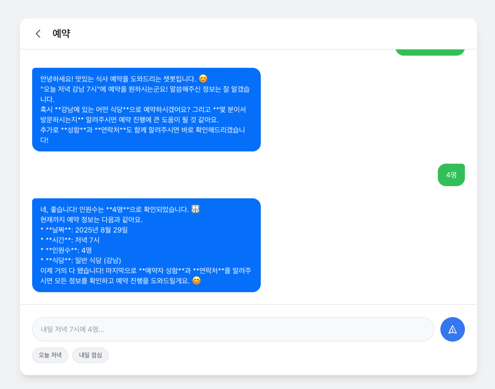
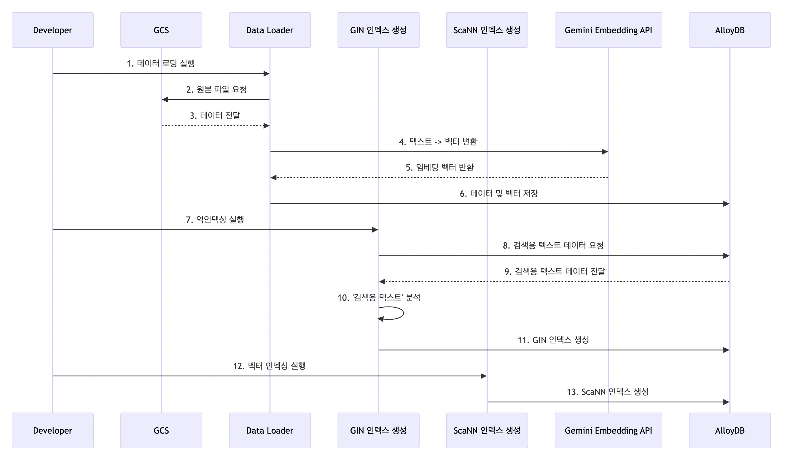

# CatchTable 프로젝트 보고서

## Demo
**접근 URL**  
http://34.49.198.236/

**샘플 화면**  

## 아키텍처

### 현재까지 구성된 아키텍처

**아키텍처 개요**
- **목적**: CatchTable 레스토랑 정보 검색 시스템 (자연어 쿼리 기반 PoC)
- **구성 요소**:
  - Google Cloud Platform 기반
  - Cloud Build를 통한 CI/CD
  - Artifact Registry를 통한 컨테이너 관리
  - Cloud Run을 통한 서비스 배포
  - Cloud Load Balancing을 통한 트래픽 분산
  - MCP Toolbox를 통한 쿼리 처리
  - PostgreSQL AlloyDB를 통한 데이터 저장

## Github
**저장소**: https://github.com/CatchTable  
**배포 방식**: Git Action을 이용하여 Cloud Build → Cloud Run으로 배포

## 응답
- **AI 모델**: Gemini Flash로 임시 응답
- **데이터베이스**: AlloyDB는 connection만 연결 중

## 데이터 적재

**데이터 플로우**
1. 개발자가 GCS에 데이터 로딩 실행
2. 원본 파일 요청
3. 데이터 전달
4. 텍스트 → 벡터 변환
5. 임베딩 벡터 반환
6. 데이터 및 벡터 저장
7. 억인덱스 실행
8. 검색용 텍스트 데이터 요청
9. 검색용 텍스트 데이터 전달
10. '검색용 텍스트' 분석
11. GIN 인덱스 생성
12. 벡터 임베딩 실행
13. ScaNN 인덱스 생성

**주요 구성 요소**
- **Developer**: 데이터 로딩 및 관리
- **GCS**: Google Cloud Storage를 통한 데이터 저장
- **Data Loader**: 데이터 처리 및 변환
- **GIN 인덱스 생성**: 텍스트 검색 최적화
- **ScaNN 인덱스 생성**: 벡터 검색 최적화
- **Gemini Embedding API**: 텍스트 임베딩 생성
- **AlloyDB**: PostgreSQL 기반 데이터베이스

## 진행 상황

### 금주 진행사항
- Google Cloud Platform 기반 아키텍처 구성 완료
- Cloud Build, Cloud Run을 통한 CI/CD 파이프라인 구축
- 기본 웹 인터페이스 개발 및 배포
- Gemini Flash를 통한 임시 응답 시스템 구현
- AlloyDB 연결 설정 (connection 단계)
- 데이터 적재 프로세스 설계 및 구현

### 차주 진행사항
- **Gemini LLM을 통한 구문분석** 테스트 및 구현
- **AlloyDB 연동** 완료 및 데이터 쿼리 테스트
- **MCP Toolbox 연동** 테스트 및 자연어 쿼리 처리 최적화
